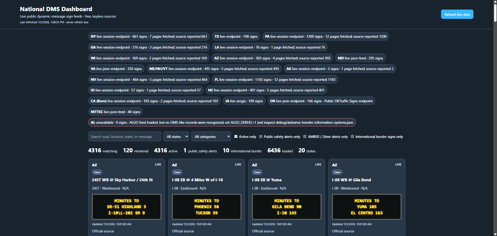

# National DMS Dashboard

A free, self-hosted dashboard that aggregates public U.S. dynamic-message-sign feeds into one searchable interface.

The project currently combines thousands of signs from statewide, regional, ArcGIS, and agency-specific sources. It preserves multi-page DMS messages, refreshes data in the background, isolates individual source failures, and provides filters for active signs, message categories, public-safety alerts, AMBER/Silver alerts, and U.S.-side international-border approach signs.

> This project is unofficial and is not affiliated with any transportation or public-safety agency. Data may be delayed, incomplete, or unavailable. Use the originating agency for authoritative traffic and emergency information.

## Screenshot



## Features

- Live aggregation from public DOT and regional traffic feeds
- Automatic backend refresh every two minutes by default
- Browser cache checks every 30 seconds
- Manual refresh and per-source status diagnostics
- Search and state filtering
- Active-sign filtering
- Message categories such as crashes, closures, construction, weather, congestion, travel time, and safety
- Controlled **Public safety alerts only** filter
- Dedicated **AMBER / Silver alerts only** filter and category
- U.S.-side international-border approach-sign filtering
- Multi-page MULTI/NTCIP message rendering
- Source-level failure isolation so one broken agency does not take down the dashboard
- No required API keys for the included sources

## Requirements

- Node.js 18 or newer
- Internet access from the machine running the server

## Install and run

```bash
npm install
cp .env.example .env
npm start
```

Open:

```text
http://localhost:3000
```

For WSL, the same commands work from the extracted project directory.

Windows users can also use `start-windows.bat`; Linux users can use `start-linux.sh`.

## Configuration

Copy `.env.example` to `.env`. The main settings are:

```env
PORT=3000
CACHE_SECONDS=90
AUTO_REFRESH_SECONDS=120
TXDOT_DISTRICTS=ALL
```

`AUTO_REFRESH_SECONDS` has a minimum of 60 seconds. Source-specific debug flags can write captured responses under `debug/`; that directory is ignored by Git.

## Filters and classification

### Public-safety alerts

The broad public-safety filter uses a controlled phrase list rather than matching every occurrence of the word `ALERT`. It recognizes AMBER, Silver, Ashanti, Gold, Blue, CLEAR, Purple, Green, Ebony, Feather, missing-child, child-abduction, endangered-missing-person/adult, and similar official advisories while excluding ordinary traffic and weather alerts.

### AMBER and Silver alerts

AMBER and Silver messages have both:

- a dedicated **AMBER / Silver alerts only** checkbox
- a permanent **AMBER / Silver Alert** category, even when no matching alert is active

### International-border signs

The international-border filter combines message classification with known physical U.S.-side border-approach signs. NITTEC contributes Buffalo–Niagara VMS records; bridge wait-time data is intentionally not imported.

## Tests

```bash
npm test
```

Run the repository secret scan with:

```bash
npm run scan:secrets
```

GitHub Actions runs both checks on pushes and pull requests.

## Data sources

See [SOURCES.md](SOURCES.md) for the current agency inventory, coverage notes, public endpoints, known gaps, and attribution details.

## Known limitations

- Public endpoints can change or disappear without notice.
- Alabama currently has no confirmed public DMS feed in the project.
- California coverage is partial and currently limited to the Kern-region source.
- Some agencies expose inactive, blank, stale, or overlapping signs.
- Public-safety terminology varies by jurisdiction and may require future classifier updates.
- The dashboard does not guarantee complete national or border coverage.

## Security and privacy

- Do not commit `.env`, session cookies, copied browser cURL commands, HAR files, API keys, or debug response dumps.
- The included feeds do not require stored private credentials.
- `.gitignore` excludes local environment files, debug output, archives, and common captured-response formats.
- `npm run scan:secrets` checks for known session-cookie and credential patterns before publication.

## Contributing

New adapters should use stable public sources, avoid hardcoded cookies or tokens, normalize records into the existing sign structure, preserve source attribution, and include parser tests.

When reporting a source, include the agency, public page, endpoint, sample response structure, authentication requirements, and geographic coverage—but remove all personal cookies and tokens first.

## License

Released under the [MIT License](LICENSE).
